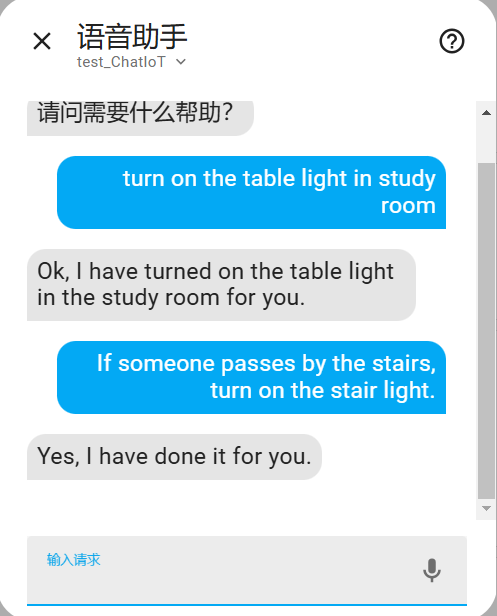

ChatIoT Conversation
===
This project a component to control your Home Assistant as a personal assistant. The goal is to provide a drop in solution to be used as a "conversation agent" component by Home Assistant. Users can control the devices and create automations in natural language.

# Quick Start
Search "ChatIoT" in HACS in Home Assistant, and install it. After a simple configuration, it can be used as a "conversation agent".

# Usage
After the user completes the configuration in the voice assistant, he can choose to talk to ChatIoT in the dialogue window. ChatIoT can help users control devices and create automation.

## Control Devices

User: turn on the table light in study room

Assistant: Ok, I have turned on the table light in the study room for you.

## Create Automations

User: If someone passes by the stairs, turn on the stair light.

Assistant: Yes, I have done it for you.

