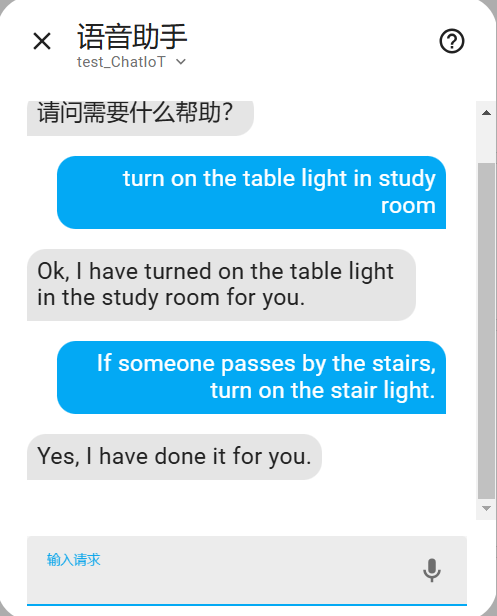

ChatIoT
===
This project a component to control your Home Assistant as a personal assistant. The goal is to provide a drop in solution to be used as a "conversation agent" component by Home Assistant. Users can control the devices and create automations in natural language.

# Requirements
- A supported version of Home Assistant; `2023.8.0` or newer
- SSH or Samba access to your Home Assistant instance
- [HACs](https://hacs.xyz/docs/setup/download/) is installed

# Install the Home Assistant Component with HACs
The following link will open your Home Assistant installation and download the integration:
Remember to restart Home Assistant after install the component!

# Usage
After the user completes the configuration in the voice assistant, he can choose to talk to ChatIoT in the dialogue window. ChatIoT can help users control devices and create automation.

### 1 Control Devices

**User**: turn on the table light in study room

**Assistant**: Ok, I have turned on the table light in the study room for you.

### 2 Create Automations

**User**: If someone passes by the stairs, turn on the stair light.

**Assistant**: Yes, I have done it for you.

