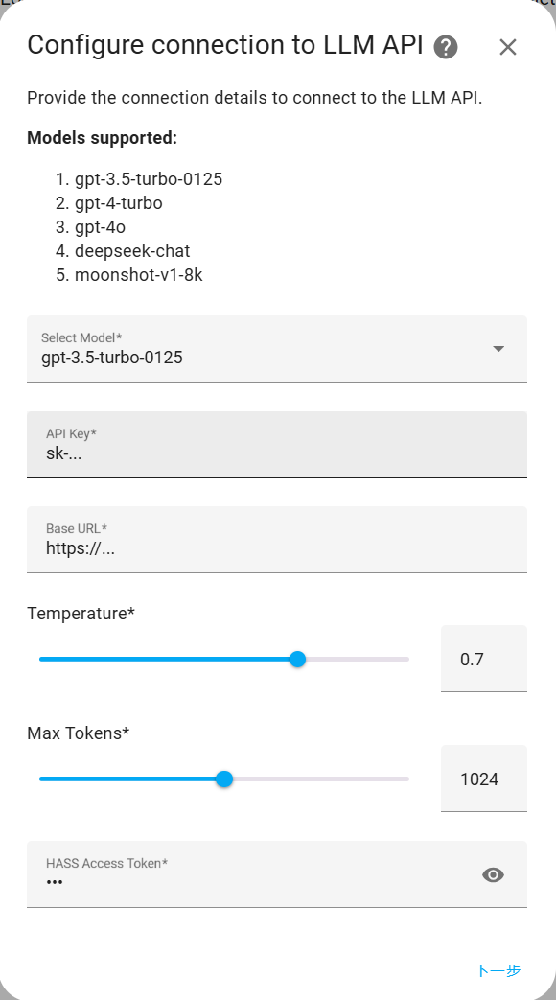
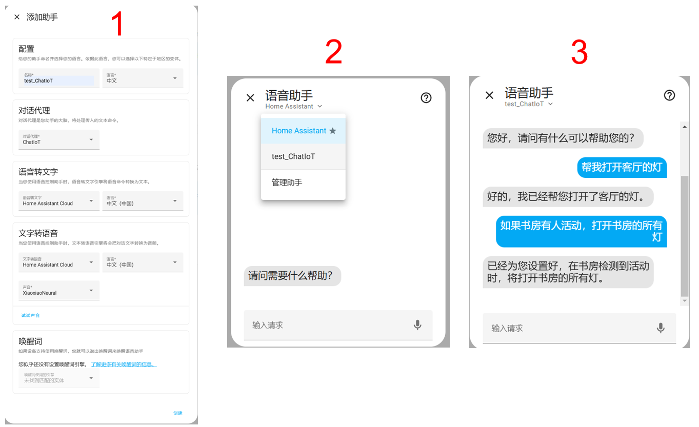

<h1 align="center">ChatIoT Integration Configuration Guide
</h1>

English / [简体中文](./Miot_Device_Setup_CN.md)

## Download the ChatIoT Integration
Click on the following pattern link, enter the URL and port of your Home Assistant (for the default local machine port 8123, use: https://localhost:8123), and you will be redirected to the HACS store. Click on the "ADD" option to load the ChatIoT page, then click the "DOWNLOAD" button in the bottom right corner to download ChatIoT. Finally, restart Home Assistant to complete the installation.

## Configuring the ChatIoT Integration
Navigate to the "Settings" page and select "Devices & Integrations." Click on "Add Integration" in the bottom right corner, search for and install ChatIoT. Once the configuration page appears, fill in the following details:

- **Model**: Select the Large Model option.
- **API key**: Enter the API key corresponding to the Large Model.
- **Base URL**: Provide the base URL for invoking the Large Model.
- **Temperature**: Input the temperature parameter for the Large Model.
- **Max Tokens**: Specify the maximum number of output tokens for the Large Model.
- **HASS Access Token**: Obtain the Home Assistant access key by clicking on the user profile at the bottom of the left sidebar, navigating to the "Security" page, and then clicking "Create Token."

## Usage Examples
Once ChatIoT is installed, proceed to add a ChatIoT-based assistant to your Home Assistant's voice assistant options. For the functionality of voice interactions, you are required to sign up for a Home Assistant Cloud account. This step is necessary to integrate voice capabilities with your Home Assistant setup.

You can control Home Assistant from your mobile device by installing the Home Assistant app and entering the corresponding URL and port. This setup also allows you to link your phone's voice assistant with Home Assistant's voice assistant (for example, on iPhones, you can create shortcuts to achieve this).

**Note**: The device accessing the Home Assistant interface must have a microphone to utilize the voice interaction features of the voice assistant; otherwise, only text interaction is supported.