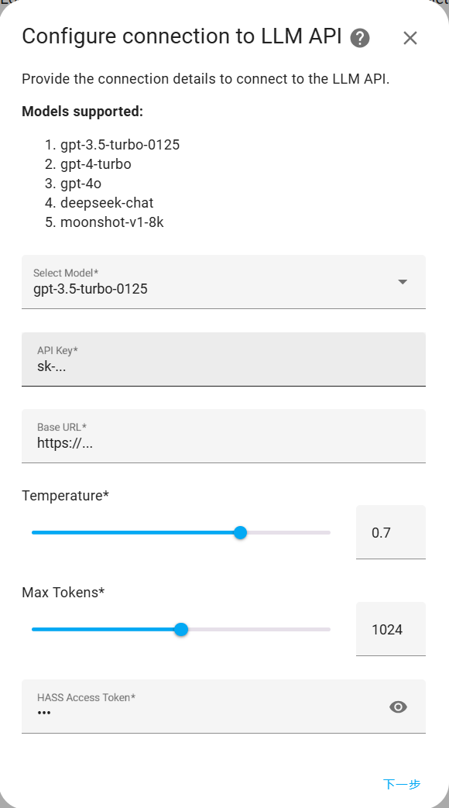
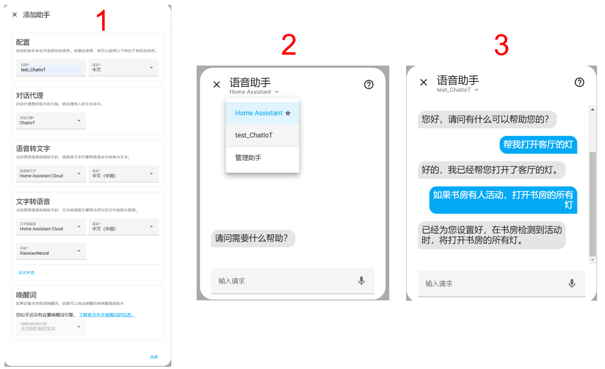

<h1 align="center">ChatIoT集成配置指南</h1>

[English](./Miot_Device_Setup.md) / 简体中文

## 下载ChatIoT集成
点击下方图案链接，填入Home Assistant的网址和端口（默认本机8123端口的话：https://localhost:8124），跳转到HACS商店，点击“ADD”选项加载ChatIoT页面，然后点击右下角的“DOWNLOAD”按钮下载ChatIoT，重启Home Assistant。

## 配置ChatIoT集成
在“设置”页面中选择“设备与集成”，点击右下角“添加集成”，搜索并安装ChatIoT，随后在出现的配置页面中填入如下内容：
- Model：选择大模型；
- API key：对应大模型的api key；
- Base URL：调用大模型的base url；
- Temperature：调用大模型时的温度参数；
- Max Tokens：大模型的最大输出token数；
- HASS Access Token：Home Assistant的access key，从左侧边栏点击最下角的用户进入用户界面，选择“安全”页面，点击“创建令牌”得到。

## 使用示例
安装好ChatIoT后，需要在Home Assistant的语音助手中添加基于ChatIoT的助手。如果你希望拥有语音交互的功能，目前需要你自行注册Home Assistant Cloud账号。

你可以通过在手机上安装Home Assistant APP，填入对应的网址和端口，实现在手机控制Home Assistant，并且可以通过手机的语音助手来联动Home Assistant的语音助手（如苹果手机通过创建快捷指令）。

**注意**：访问Home Assistant页面的设备需要有麦克风才能使用语音助手中的语音交互功能，否则只支持文字交互。