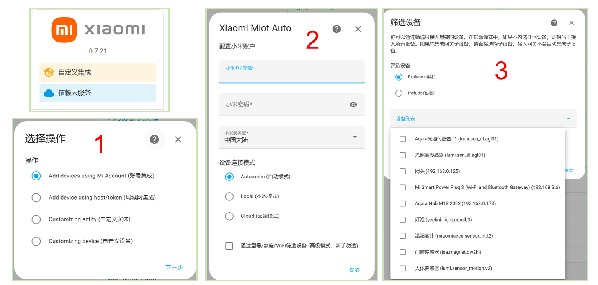

<div align="center">

<h1 align="center">Home Assistant安装指南</h1>

[English](./Miot_Device_Setup.md) / 简体中文
</div>

# Home Assistant安装
[Home Assistant](https://www.home-assistant.io/)是一个开源的智能家居平台，允许你接入不同生态的智能家居设备来统一控制，有多种安装方式请参考Home Assistant的官网教程。

我们推荐采用Docker进行安装，接下来将带你一步步进行下载和部署。

1、安装Docker。

2、启动Docker，拉取Home Assistant镜像，推荐使用最新版本2024。
```bash
docker pull homeassistant/home-assistant:2024.10.0 
```
3、运行Home Assistant镜像。
```bash
# 如果你需要模拟设备，或者想要方便地深入了解Home Assistant配置，请选择方案2
# 方案2的预备操作：创建子网
docker network create --subnet=172.20.0.0/16 --gateway=172.20.0.1 chatiot

# 方案1
# 默认Home Assistant页面挂载到8123端口
docker run -d --name="hass" --net=host -p 8123:8123 homeassistant/home-assistant:2024.10.0

# 方案2
# /config是Home Assistant的配置文件，推荐挂载到本地的一个目录
# 你可以选择一个自己希望的端口来访问Home Assistant用户页面
docker run -d --name="hass" -v /path/to/your/config:/config -p your_local_port:8123 --net=chatiot --ip=172.20.0.3 homeassistant/home-assistant:2024.10.0
```

安装成功后，你将可以通过访问本地网址的设定端口来访问Home Assistant用户页面。

# HACS商店安装
[HACS](https://hacs.xyz/)是Home Assistant上的一个第三方集成商店，你可以通过下载安装它，来使用很多第三方开发的集成，如我们要使用的Xiaomi Miot Auto集成。更多有趣的集成等你自行探索。

1、下载HACS安装脚本并运行。
```bash
# 进入到自己的Home Assistant容器
docker exec -it hass /bin/bash 
# 下载HACS的安装脚本并运行
wget -q -O - https://get.hacs.xyz | bash -
```
2、重启Home Assistant

Home Assistant下载安装集成，都需要经过重启才能生效。你可以通过访问Home Assistant的界面，在左侧边栏上点击“开发者工具”，然后在页面上找到“配置检查与重启”，先点击“检查配置”，没有问题时再点击“重新启动”。

3、配置HACS

重启后再打开Home Assistant的用户界面，点击侧边栏“设置”，点击“设备与服务”，选择“集成”，点击右下角“添加集成”，搜索“HACS”进行安装。这其中需要通过Github账号绑定才能使用HACS商店，请根据指引操作，也可参考详细的[博客](https://blog.csdn.net/sunky7/article/details/137619019)指引进行安装。

# 设备接入
目前ChatIoT仅支持可以通过[Xiaomi Miot Auto](https://github.com/al-one/hass-xiaomi-miot)集成安装的米家设备，更多类型的设备支持正在开发。

1、米家设备按照小米设备说明接入到米家APP，要求知道自己的小米账号和密码，后续接入时需要。

2、在Home Assistant的HACS商店中，搜索“Xiaomi Miot Auto”，下载该集成，然后点击侧边栏“设置”，点击“设备与服务”，选择“集成”，点击右下角“添加集成”，搜索“Xiaomi Miot Auto”进行安装。

3、重启Home Assistant。

4、点击该集成的卡片，然后点击页面上的“添加条目”，选择“账号集成”选项后下一步，输入自己的小米ID和密码，点击提交。

5、选择需要接入的米家设备，接下来你就可以在设备页面中看到接入的设备。

<p align="center">
<a href=""></a>
</p>