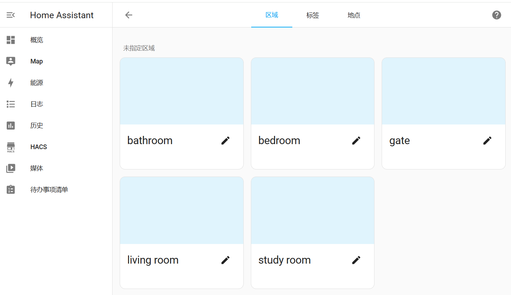

<div align="center">

<h1 align="center">MIoT Device Simulation Guide</h1>

English / [简体中文](./Miot_Device_Setup_CN.md)
</div>

## Introduction to MIoT
The MIoT protocol is a communication protocol standard for smart devices that Xiaomi has been promoting since 2018 for its smart home ecosystem.

For a detailed introduction to MIoT, refer to the [Xiaomi Developer Platform Documentation](https://iot.mi.com/v2/new/doc/home), and for devices that comply with this protocol, see the [Xiaomi/Mijia Product Library](https://home.miot-spec.com/). This guide primarily focuses on how to simulate such devices using Docker.

## MIoT Device Simulation and Integration
### Device Simulation
Simulating MIoT devices is mainly supported by the miot-simulator in the [python-miio library](https://github.com/rytilahti/python-miio).

For ease of use, we have packaged an image called leafli/miot-simulator, which you can use to simulate devices.

1. Pull the image.
```bash
docker search leafli/miot-simulator:v1.0.0
# If not found, check your network
docker pull leafli/miot-simulator:v1.0.0
```
2. Clone this repository or download the /devices/miot_devices folder.

It contains the object model files (Spec files in JSON format) needed to simulate Mi Home devices. You can also download the devices you want to simulate from the Xiaomi/Mijia Product Library, noting that the file name should be in the format model.json.

3. Launch the image to simulate the device.
```bash
# Simulate the device and specify the device's IP address.
docker run -d --network=chatiot --ip=ip_in_chatiot_network -v .:/spec --name=curtain_living_room miot-simulator miiocli devtools miot-simulator --file device_spec_file --model device_model
```

### Virtual Home - Example
Here we provide an example of simulating a simple three-bedroom home, assuming a subnet (172.20.0.0) has been created and Home Assistant is installed within that subnet.

1. Create home areas on Home Assistant: Front Door, Living Room, Bedroom, Bathroom, Study Room.

<p align="center">
<a href=""></a>
</p>

2. Simulate devices 

Simulate several devices, assigning them to different areas and different IPs. Assuming you have a miot_devices folder containing all the spec files from /devices/miot_devices in the repository.
```bash
# Navigate to the miot_devices folder
cd /path/to/miot_devices
```
Gate：
- Magnet Sensor (172.20.0.4)
```bash
 docker run -d --network=chatiot --ip=172.20.0.4 -v .:/spec --name=gate_magnet_sensor leafli/miot-simulator:v1.0.0 miiocli devtools miot-simulator --file /spec/isa.magnet.dw2hl.json --model isa.magnet.dw2hl
```

Living Room:
- Ceiling Light（172.20.0.5）
```bash
docker run -d --network=chatiot --ip=172.20.0.5 -v .:/spec --name=living_room_light leafli/miot-simulator:v1.0.0 miiocli devtools miot-simulator --file /spec/lumi.light.cwopcn02.json --model lumi.light.cwopcn02 
```
- Air Conditioner (172.20.0.6)
```bash
docker run -d --network=chatiot --ip=172.20.0.6 -v .:/spec --name=living_room_aircondition leafli/miot-simulator:v1.0.0 miiocli devtools miot-simulator --file /spec/xiaomi.aircondition.mc7.json --model xiaomi.aircondition.mc7
```
- TV (172.20.0.7)
```bash
docker run -d --network=chatiot --ip=172.20.0.7 -v .:/spec --name=living_room_tv leafli/miot-simulator:v1.0.0 miiocli devtools miot-simulator --file /spec/xiaomi.tv.eanfv1.json --model xiaomi.tv.eanfv1
```
- Illumination Sensor (172.20.0.8)
```bash
docker run -d --network=chatiot --ip=172.20.0.8 -v .:/spec --name=living_room_illumination_sensor leafli/miot-simulator:v1.0.0 miiocli devtools miot-simulator --file /spec/lumi.sen_ill.mgl01.json --model lumi.sen_ill.mgl01
```

Bedroom:
- Ceiling Light (172.20.0.9)
```bash
docker run -d --network=chatiot --ip=172.20.0.9 -v .:/spec --name=bedroom_light leafli/miot-simulator:v1.0.0 miiocli devtools miot-simulator --file /spec/lumi.light.cwopcn03.json --model lumi.light.cwopcn03
```
- Air Conditioner (172.20.0.10)
```bash
docker run -d --network=chatiot --ip=172.20.0.10 -v .:/spec --name=bedroom_aircondition leafli/miot-simulator:v1.0.0 miiocli devtools miot-simulator --file /spec/xiaomi.aircondition.mc2.json --model xiaomi.aircondition.mc2
```
- Temperature and Humidity Sensor (172.20.0.11)
```bash
docker run -d --network=chatiot --ip=172.20.0.11 -v .:/spec --name=bedroom_ht_sensor leafli/miot-simulator:v1.0.0 miiocli devtools miot-simulator --file /spec/miaomiaoce.sensor_ht.t2.json --model miaomiaoce.sensor_ht.t2
```

Bathroom:
- Bathroom Heater (172.20.0.12)
```bash
docker run -d --network=chatiot --ip=172.20.0.12 -v .:/spec --name=bathroom_heater_fan leafli/miot-simulator:v1.0.0 miiocli devtools miot-simulator --file /spec/yeelink.bhf_light.v8.json --model yeelink.bhf_light.v8
```
- Water Heater (172.20.0.13)
```bash
docker run -d --network=chatiot --ip=172.20.0.13 -v .:/spec --name=bathroom_waterheater leafli/miot-simulator:v1.0.0 miiocli devtools miot-simulator --file /spec/viomi.waterheater.e14.json --model viomi.waterheater.e14
```

Study Room:
- Ceiling Light (172.20.0.14)
```bash
docker run -d --network=chatiot --ip=172.20.0.14 -v .:/spec --name=study_room_ceiling_light leafli/miot-simulator:v1.0.0 miiocli devtools miot-simulator --file /spec/lumi.light.cwopcn01.json --model lumi.light.cwopcn01
```
- Desk Lamp (172.20.0.15)
```bash
docker run -d --network=chatiot --ip=172.20.0.15 -v .:/spec --name=study_room_table_light leafli/miot-simulator:v1.0.0 miiocli devtools miot-simulator --file /spec/yeelink.light.mono6.json --model yeelink.light.mono6
```
- Motion Sensor (172.20.0.16)
```bash
docker run -d --network=chatiot --ip=172.20.0.16 -v .:/spec --name=study_room_motion_sensor leafli/miot-simulator:v1.0.0 miiocli devtools miot-simulator --file /spec/lumi.sensor_motion.v2.json --model lumi.sensor_motion.v2
```

**Note**: Currently, only one device per object model can be simulated at a time; a second cannot be integrated via Xiaomi Miot Auto. If you need multiple devices of the same type, you will need to find devices of the same type but with different models. Some devices may not respond when integrated into Home Assistant; if you wish to see changes in device status when controlling them, please explore on your own.

3、Integrate virtual devices into your home using Xiaomi Miot Auto

Enter the Xiaomi Miot Auto integration, click on "Add Device," select "LAN Integration," fill in the corresponding device IP, Token as 00000000000000000000000000000000 (32 zeros by default), and device name, then click "Submit" and choose the corresponding device area.

<p align="center">
<a href=""></a>
</p>

In the end, we have created a virtual home with the following 13 virtual devices.

<p align="center">
<a href=""></a>
</p>
