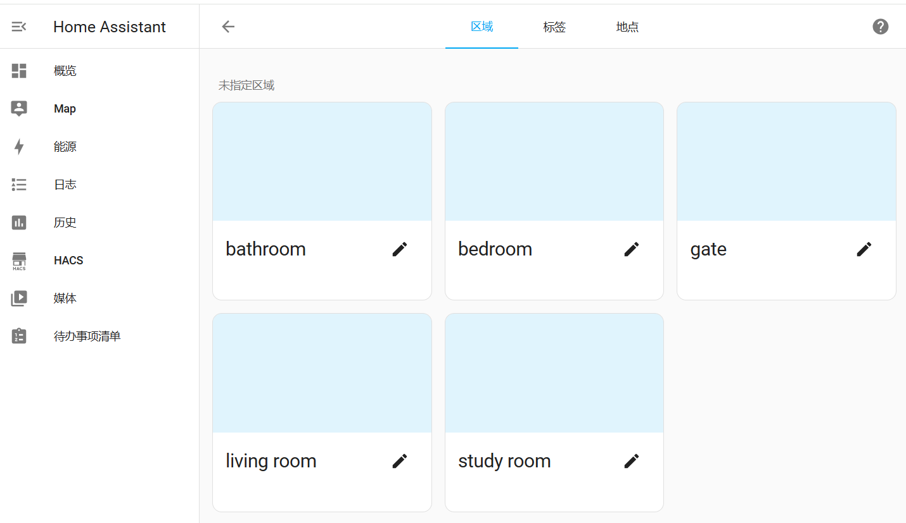
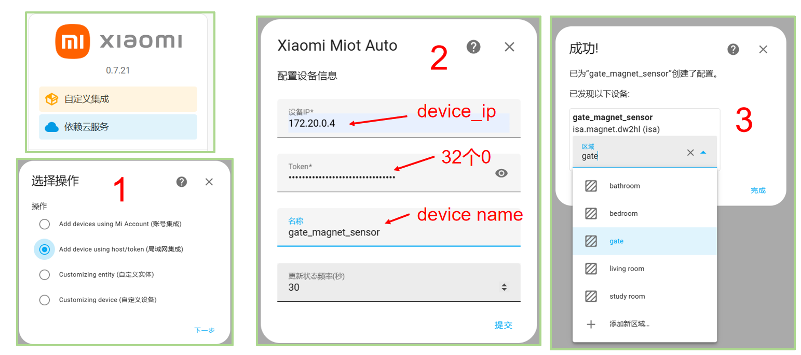
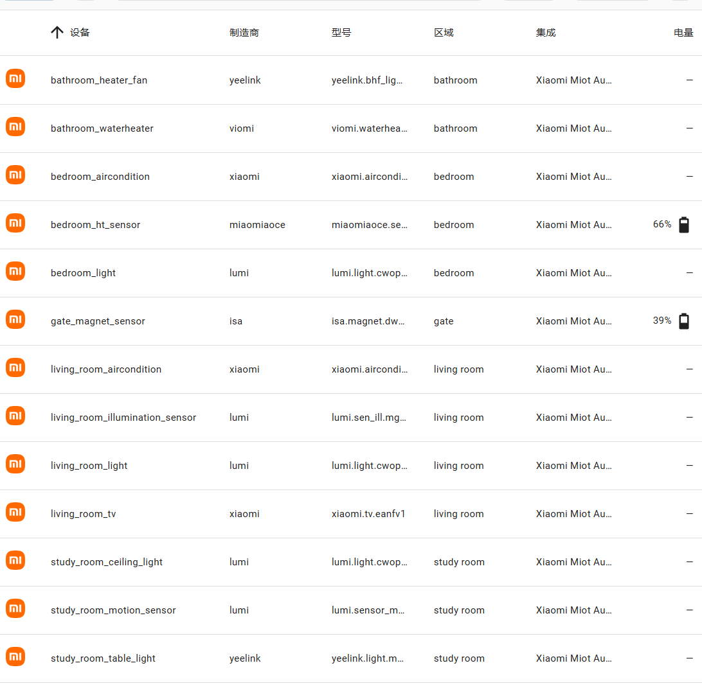

<div align="center">

<h1 align="center">MIoT设备模拟指南</h1>

[English](./Miot_Device_Setup.md) / 简体中文
</div>

## MIoT介绍
MIoT协议是小米智能家居从2018年起推行的智能设备通信协议规范。

详细的MIoT介绍参考[小米开发者平台文档](https://iot.mi.com/v2/new/doc/home)，符合该协议的设备参见[小米/米家产品库](https://home.miot-spec.com/)，这里主要介绍如何通过docker模拟该类设备。

## MIoT设备模拟及接入
### 设备模拟
模拟MIoT设备主要通过[python-miio](https://github.com/rytilahti/python-miio)库中的miot-simulator支持。

为了方便使用，我们打包了一个镜像leafli/miot-simulator，你可以通过该镜像来模拟设备。

1、拉取镜像。
```bash
docker search leafli/miot-simulator:v1.0.0
# 如果没有搜索到，请检查自己的网络问题
docker pull leafli/miot-simulator:v1.0.0
```
2、clone本仓库，或者下载/devices/miot_devices文件夹。

其中包含了模拟米家设备所需要的物模型文件（即Spec文件，json格式），也可以自行在[小米/米家产品库](https://home.miot-spec.com/)中下载自己想要模拟的设备，注意文件命名，格式为model.json。

3、启动镜像模拟设备。
```bash
# 模拟设备，并指定设备的ip地址。
docker run -d --network=chatiot --ip=ip_in_chatiot_network -v .:/spec --name=curtain_living_room miot-simulator miiocli devtools miot-simulator --file device_spec_file --model device_model
```

### 虚拟家庭-参考示例
这里我们给出模拟一个简单三室一厅家庭的示例，假设已经创建了子网（172.20.0.0），并且Home Assistant安装在该子网中。

1、在Home Assistant上创建家庭区域：家门、客厅、卧室、浴室、书房。
<p align="center">
<a href=""></a>
</p>

2、模拟设备
模拟若干设备，分配到了不同区域和不同的ip。
假设你已经有了一个miot_devices文件夹，其中包含了仓库下/devices/miot_devices中的所有spec文件。
```bash
# 导航到miot_devices文件夹
cd /path/to/miot_devices
```
家门：
- 门窗传感器（172.20.0.4）
```bash
 docker run -d --network=chatiot --ip=172.20.0.4 -v .:/spec --name=gate_magnet_sensor leafli/miot-simulator:v1.0.0 miiocli devtools miot-simulator --file /spec/isa.magnet.dw2hl.json --model isa.magnet.dw2hl
```

客厅：
- 吸顶灯（172.20.0.5）
```bash
docker run -d --network=chatiot --ip=172.20.0.5 -v .:/spec --name=living_room_light leafli/miot-simulator:v1.0.0 miiocli devtools miot-simulator --file /spec/lumi.light.cwopcn02.json --model lumi.light.cwopcn02 
```
- 空调（172.20.0.6）
```bash
docker run -d --network=chatiot --ip=172.20.0.6 -v .:/spec --name=living_room_aircondition leafli/miot-simulator:v1.0.0 miiocli devtools miot-simulator --file /spec/xiaomi.aircondition.mc7.json --model xiaomi.aircondition.mc7
```
- 电视（172.20.0.7）
```bash
docker run -d --network=chatiot --ip=172.20.0.7 -v .:/spec --name=living_room_tv leafli/miot-simulator:v1.0.0 miiocli devtools miot-simulator --file /spec/xiaomi.tv.eanfv1.json --model xiaomi.tv.eanfv1
```
- 光照传感器（172.20.0.8）
```bash
docker run -d --network=chatiot --ip=172.20.0.8 -v .:/spec --name=living_room_illumination_sensor leafli/miot-simulator:v1.0.0 miiocli devtools miot-simulator --file /spec/lumi.sen_ill.mgl01.json --model lumi.sen_ill.mgl01
```

卧室：
- 吸顶灯（172.20.0.9）
```bash
docker run -d --network=chatiot --ip=172.20.0.9 -v .:/spec --name=bedroom_light leafli/miot-simulator:v1.0.0 miiocli devtools miot-simulator --file /spec/lumi.light.cwopcn03.json --model lumi.light.cwopcn03
```
- 空调（172.20.0.10）
```bash
docker run -d --network=chatiot --ip=172.20.0.10 -v .:/spec --name=bedroom_aircondition leafli/miot-simulator:v1.0.0 miiocli devtools miot-simulator --file /spec/xiaomi.aircondition.mc2.json --model xiaomi.aircondition.mc2
```
- 温湿度传感器（172.20.0.11）
```bash
docker run -d --network=chatiot --ip=172.20.0.11 -v .:/spec --name=bedroom_ht_sensor leafli/miot-simulator:v1.0.0 miiocli devtools miot-simulator --file /spec/miaomiaoce.sensor_ht.t2.json --model miaomiaoce.sensor_ht.t2
```

浴室：
- 浴霸（172.20.0.12）
```bash
docker run -d --network=chatiot --ip=172.20.0.12 -v .:/spec --name=bathroom_heater_fan leafli/miot-simulator:v1.0.0 miiocli devtools miot-simulator --file /spec/yeelink.bhf_light.v8.json --model yeelink.bhf_light.v8
```
- 热水器（172.20.0.13）
```bash
docker run -d --network=chatiot --ip=172.20.0.13 -v .:/spec --name=bathroom_waterheater leafli/miot-simulator:v1.0.0 miiocli devtools miot-simulator --file /spec/viomi.waterheater.e14.json --model viomi.waterheater.e14
```

书房：
- 吸顶灯（172.20.0.14）
```bash
docker run -d --network=chatiot --ip=172.20.0.14 -v .:/spec --name=study_room_ceiling_light leafli/miot-simulator:v1.0.0 miiocli devtools miot-simulator --file /spec/lumi.light.cwopcn01.json --model lumi.light.cwopcn01
```
- 桌灯（172.20.0.15）
```bash
docker run -d --network=chatiot --ip=172.20.0.15 -v .:/spec --name=study_room_table_light leafli/miot-simulator:v1.0.0 miiocli devtools miot-simulator --file /spec/yeelink.light.mono6.json --model yeelink.light.mono6
```
- 运动传感器（172.20.0.16）
```bash
docker run -d --network=chatiot --ip=172.20.0.16 -v .:/spec --name=study_room_motion_sensor leafli/miot-simulator:v1.0.0 miiocli devtools miot-simulator --file /spec/lumi.sensor_motion.v2.json --model lumi.sensor_motion.v2
```

**注意**：同一个物模型对应的设备目前只能同时模拟一个，第二个无法通过Xiaomi Miot Auto集成接入，如果你需要多个同类型的设备，你可以去找同类型但不同model的设备。有些设备接入到Home Assistant无法响应，如果你希望你在控制设备时，设备状态可以看见变化，请自行尝试探索。

3、基于Xiaomi Miot Auto集成把虚拟设备接入家庭

进入Xiaomi Miot Auto集成，点击添加项目，选择“局域网集成”，填入对应的设备ip、Token为00000000000000000000000000000000（默认32个0）、设备名称，然后点击“提交”，选择对应的设备区域。

<p align="center">
<a href=""></a>
</p>

最终我们得到如下的虚拟家庭，包含13个虚拟设备。

<p align="center">
<a href=""></a>
</p>
